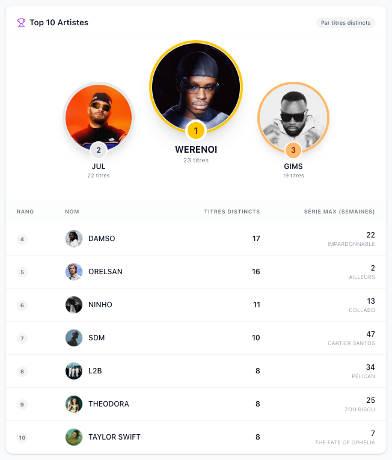

# SNEP Top 50 Analytics & Dashboard



A full-stack data project that scrapes weekly French music charts (SNEP), enriches data via Genius API, stores it in PostgreSQL, and visualizes trends in a modern Next.js dashboard.

## 🏗 Architecture

- **ETL Pipeline**: Python scripts scrape SNEP website and fetch metadata from Genius (Producers, Writers, Samples).
- **Orchestration**: Apache Airflow schedules weekly updates.
- **Database**: PostgreSQL stores historical chart data (2020-Present).
- **Frontend**: Next.js (React) + Tailwind CSS + Recharts for interactive analytics.
- **Infrastructure**: Fully containerized with Docker Compose.

## 🚀 Features

- **Multi-Year Analysis**: Browse Top 50 charts from 2020 to present.
- **Artist & Producer Analytics**: Visualize rankings, weeks in Top 50, and collaborations.
- **New! Editor Analytics**: Track performance of music publishers/editors.
- **Smart Search**: Instantly find Artists, Producers, or Editors with the new search bar.
- **Data Enrichment**: Automatically fetches producers, writers, and samples via Genius API.

## 🚀 Getting Started

### Prerequisites

- Docker & Docker Compose
- Git
- Node.js (for the dashboard)

### Installation

1.  **Clone the repository**

    ```bash
    git clone https://github.com/Camil444/top-single-snep.git
    cd top-single-snep
    ```

2.  **Configure Environment Variables**

    Create a `.env` file in the root directory and add your configuration:

    ```env
    # Database Configuration
    POSTGRES_USER=db_user
    POSTGRES_PASSWORD=db_password
    POSTGRES_DB=db
    DB_HOST=db
    DB_PORT=5432

    # Genius API Token (Get one at https://genius.com/api-clients)
    GENIUS_ACCESS_TOKEN=your_genius_access_token_here
    ```

3.  **Start the stack**

    ```bash
    docker-compose up -d --build
    ```

4.  **Create Airflow Admin User**

    ```bash
    docker-compose exec af airflow users create \
        --username admin \
        --firstname Admin \
        --lastname User \
        --role Admin \
        --email admin@example.com \
        --password admin
    ```

5.  **Initialize Data**

    You can initialize the database using the provided script:

    ```bash
    chmod +x scripts/full_reload.sh
    cd scripts
    ./full_reload.sh
    ```

    Alternatively, use Airflow:

    - Go to **http://localhost:8080** (Login: `admin` / `admin`).
    - Enable and Trigger the `snep_update_weekly` DAG (Runs daily at 11:00).

6.  **Start Dashboard**

    The dashboard runs locally outside of Docker.

    ```bash
    cd viz_dashboard
    # Create local env file for the dashboard
    echo "GENIUS_ACCESS_TOKEN=your_token_here" > .env.local

    npm install
    npm run dev
    ```

7.  **Access Dashboard**
    - Open **http://localhost:3000** to view the analytics.

## 📂 Project Structure

- `airflow/`: DAGs and Airflow configuration.
- `scripts/`: Python ETL scripts (`scrap.py`, `update_data.py`, `insert_record.py`, `full_reload.sh`).
- `viz_dashboard/`: Next.js frontend application.
- `postgres/`: Database initialization and data storage.
- `data/`: CSV backups of chart data.

---

_Built with Python, Next.js, Docker._
