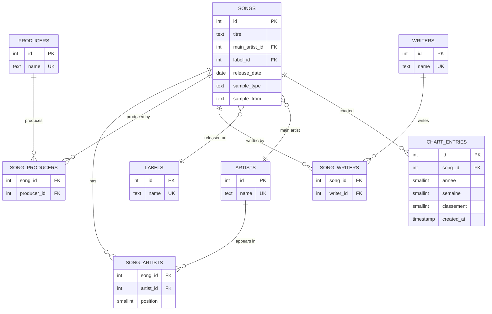

# Database Schema - SNEP Top Singles (Normalized)

## Entity Relationship Diagram


```mermaid
erDiagram
    LABELS {
        int id PK
        text name UK
    }

    ARTISTS {
        int id PK
        text name UK
    }

    PRODUCERS {
        int id PK
        text name UK
    }

    WRITERS {
        int id PK
        text name UK
    }

    SONGS {
        int id PK
        text titre
        int main_artist_id FK
        int label_id FK
        date release_date
        text sample_type
        text sample_from
    }

    SONG_ARTISTS {
        int song_id FK
        int artist_id FK
        smallint position
    }

    SONG_PRODUCERS {
        int song_id FK
        int producer_id FK
    }

    SONG_WRITERS {
        int song_id FK
        int writer_id FK
    }

    CHART_ENTRIES {
        int id PK
        int song_id FK
        smallint annee
        smallint semaine
        smallint classement
        timestamp created_at
    }

    SONGS ||--o{ SONG_ARTISTS : "has"
    ARTISTS ||--o{ SONG_ARTISTS : "appears in"
    SONGS ||--o{ SONG_PRODUCERS : "produced by"
    PRODUCERS ||--o{ SONG_PRODUCERS : "produces"
    SONGS ||--o{ SONG_WRITERS : "written by"
    WRITERS ||--o{ SONG_WRITERS : "writes"
    SONGS }o--|| LABELS : "released on"
    SONGS }o--|| ARTISTS : "main artist"
    SONGS ||--o{ CHART_ENTRIES : "charted"
```

## Tables Overview

| Table           | Description                                      | Key Constraint                        |
| --------------- | ------------------------------------------------ | ------------------------------------- |
| `labels`        | Record labels / éditeurs                         | `UNIQUE (name)`                       |
| `artists`       | All artists (main + featured), stored uppercased | `UNIQUE (name)`                       |
| `producers`     | All producers, stored uppercased                 | `UNIQUE (name)`                       |
| `writers`       | All writers/composers, stored uppercased         | `UNIQUE (name)`                       |
| `songs`         | One row per unique song                          | `UNIQUE (titre, main_artist_id)`      |
| `song_artists`  | Maps songs to all their artists with position    | `PK (song_id, artist_id)`             |
| `song_producers`| Maps songs to their producers                    | `PK (song_id, producer_id)`           |
| `song_writers`  | Maps songs to their writers                      | `PK (song_id, writer_id)`             |
| `chart_entries` | One row per weekly chart position                | `UNIQUE (annee, semaine, classement)` |

## Column Descriptions

### songs
| Column          | Type    | Description                                          |
| --------------- | ------- | ---------------------------------------------------- |
| `id`            | INT     | Primary key                                          |
| `titre`         | TEXT    | Song title (cleaned, no feat. parentheses)           |
| `main_artist_id`| INT FK  | Reference to the main artist in `artists`            |
| `label_id`      | INT FK  | Reference to the record label in `labels`            |
| `release_date`  | DATE    | Official release date (from Genius API)              |
| `sample_type`   | TEXT    | Type of sample used (e.g. "sample", "interpolation") |
| `sample_from`   | TEXT    | Original sampled song/artist                         |

### song_artists
| Column     | Type     | Description                                             |
| ---------- | -------- | ------------------------------------------------------- |
| `song_id`  | INT FK   | Reference to `songs`                                    |
| `artist_id`| INT FK   | Reference to `artists`                                  |
| `position` | SMALLINT | 1 = main artist, 2 = first feat, 3 = second feat, etc. |

### chart_entries
| Column       | Type      | Description                           |
| ------------ | --------- | ------------------------------------- |
| `id`         | INT       | Primary key                           |
| `song_id`    | INT FK    | Reference to `songs`                  |
| `annee`      | SMALLINT  | Year (2020–present)                   |
| `semaine`    | SMALLINT  | ISO week number (1–53)                |
| `classement` | SMALLINT  | Chart position (1–200)                |
| `created_at` | TIMESTAMP | Row insertion timestamp               |

## Indexes

| Index                    | Table           | Columns              |
| ------------------------ | --------------- | -------------------- |
| `idx_chart_annee_semaine`| chart_entries   | (annee, semaine)     |
| `idx_chart_classement`   | chart_entries   | (classement)         |
| `idx_chart_song_id`      | chart_entries   | (song_id)            |
| `idx_artists_name`       | artists         | (name)               |
| `idx_producers_name`     | producers       | (name)               |
| `idx_writers_name`       | writers         | (name)               |
| `idx_labels_name`        | labels          | (name)               |
| `idx_songs_main_artist`  | songs           | (main_artist_id)     |

## Why This Schema vs. The Old One

| Problem (old)                             | Solution (new)                                      |
| ----------------------------------------- | --------------------------------------------------- |
| 1 table per year → `UNION ALL` everywhere | Single `chart_entries` table with `annee` column    |
| `artiste_1..4` fixed columns              | `song_artists` junction table, unlimited artists    |
| `producer_1..2` fixed columns             | `song_producers` junction table, unlimited producers|
| Song metadata repeated every week         | `songs` table stores metadata once                  |
| No normalization on artist/producer names | Dedicated tables with `UNIQUE(name)`, stored UPPER  |
| Adding 2026 requires code changes         | Just insert rows with `annee = 2026`, no schema change|

## Data Flow

```
SNEP Website (Weekly)
       │
       ▼
┌──────────────┐
│  scrap.py    │ ──► Scrapes Top 200 per week
└──────────────┘
       │
       ▼
┌──────────────┐
│ update_data  │ ──► Enriches with Genius API
└──────────────┘     (producers, writers, release_date, samples)
       │
       ▼
┌──────────────────┐
│ insert_record.py │ ──► Normalizes & inserts into:
└──────────────────┘     labels, artists, producers, writers,
                         songs, song_artists, song_producers,
                         song_writers, chart_entries
       │
       ▼
┌──────────────┐
│  Dashboard   │ ──► Next.js Visualization (JOINs instead of UNION ALL)
└──────────────┘
```
