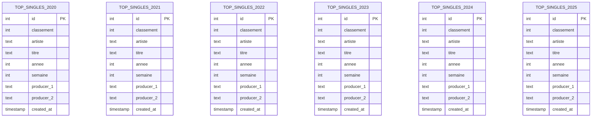

# Database Schema - SNEP Top Singles

## Entity Relationship Diagram

> **Note**: One identical table per year (2020-2025), all sharing the same structure.



## Tables Overview

> **Architecture**: 6 independent tables, one per year of data.

| Table              | Year | Description           | Records Pattern          |
| ------------------ | ---- | --------------------- | ------------------------ |
| `top_singles_2020` | 2020 | Weekly Top 200 charts | ~200 rows × 52 weeks     |
| `top_singles_2021` | 2021 | Weekly Top 200 charts | ~200 rows × 52 weeks     |
| `top_singles_2022` | 2022 | Weekly Top 200 charts | ~200 rows × 52 weeks     |
| `top_singles_2023` | 2023 | Weekly Top 200 charts | ~200 rows × 52 weeks     |
| `top_singles_2024` | 2024 | Weekly Top 200 charts | ~200 rows × 52 weeks     |
| `top_singles_2025` | 2025 | Weekly Top 200 charts | ~200 rows × current week |

## Column Descriptions

### Common structure (top_singles_2020 → top_singles_2025)

| Column          | Type      | Description                  |
| --------------- | --------- | ---------------------------- |
| `id`            | INT       | Primary key (auto-increment) |
| `classement`    | INT       | Chart position (1-200)       |
| `artiste`       | TEXT      | Main artist name             |
| `artiste_2/3/4` | TEXT      | Featured artists (if any)    |
| `titre`         | TEXT      | Song title                   |
| `editeur`       | TEXT      | Record label                 |
| `annee`         | INT       | Year of the chart            |
| `semaine`       | INT       | Week number (1-52)           |
| `producer_1/2`  | TEXT      | Producers (from Genius API)  |
| `writer_1/2`    | TEXT      | Writers (from Genius API)    |
| `release_date`  | TEXT      | Song release date            |
| `sample_type`   | TEXT      | Type of sample used          |
| `sample_from`   | TEXT      | Original sampled song        |
| `created_at`    | TIMESTAMP | Record creation timestamp    |

## Indexes

- **top_singles_YYYY** (each table):
  - Primary Key on `id`
  - Unique constraint on `(annee, semaine, classement)`

## Data Flow

```
SNEP Website (Weekly)
       │
       ▼
┌──────────────┐
│  scrap.py    │ ──► Scrapes Top 200
└──────────────┘
       │
       ▼
┌──────────────┐
│ update_data  │ ──► Enriches with Genius API
└──────────────┘     (producers, writers, samples)
       │
       ▼
┌──────────────┐
│  PostgreSQL  │ ──► top_singles_YYYY tables
└──────────────┘
       │
       ▼
┌──────────────┐
│  Dashboard   │ ──► Next.js Visualization
└──────────────┘
```
